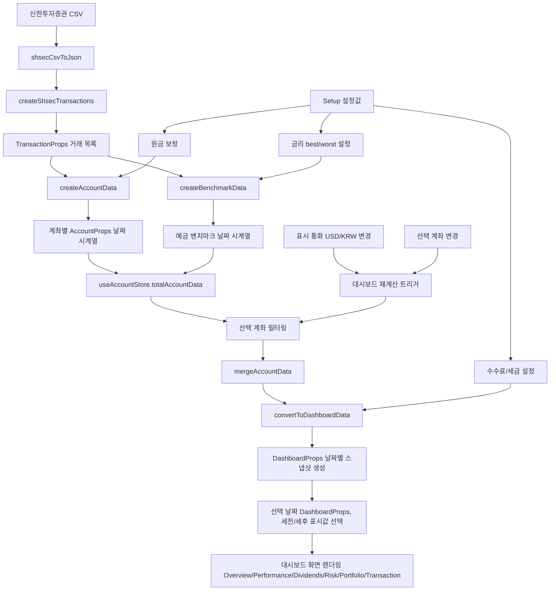
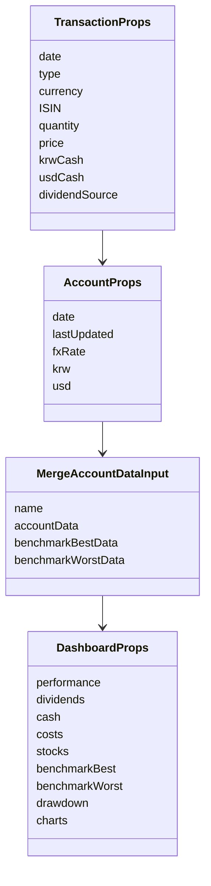

# 📈 Asset Dashboard

신한투자증권의 계좌 거래내역 데이터(CSV)를 기반으로 파생 데이터를 생성하고, 이를 직관적인 대시보드와 차트로 시각화해 주는 웹 애플리케이션입니다.

기존 증권사 앱(MTS, HTS)은 제공되는 정보가 제한적이고 UI가 직관적이지 않아 투자자가 원하는 핵심 지표를 파악하기 어렵다는 문제를 해결하기 위해 제작되었습니다.

투자 성과, 자산 현황, 배당 수익, 위험도, 포트폴리오 구성, 거래 히스토리 등을 한눈에 확인할 수 있습니다.


## 🛠️ 기술 스택 (Tech Stack)

- **Framework**: Next.js (App Router), React
- **Language**: TypeScript
- **State Management**: Zustand
- **Data fetching**: TanStack Query, Axios
- **Styling / UI**: Tailwind CSS, shadcn/ui, Lucide
- **Chart**: Recharts, d3-scale
- **Testing**: Jest
- **Code Quality**: ESLint, Prettier, Husky, lint-staged

## 어떻게 사용하나요? 🤔 (Usage)

신한투자증권 신한알파(HTS)에서 거래내역 CSV를 내려받아 Setup 페이지에 업로드합니다.

1. 신한투자증권에 로그인합니다.
2. **자산현황** 메뉴로 이동합니다.
3. **[1750] 계좌별 거래내역(원장)**을 선택합니다.
4. **[00] 전체계좌**를 선택하고 **MMW내역**을 체크합니다.
5. 조회할 기간을 설정하고 조회 버튼을 누릅니다.
6. 화면에서 우클릭 후 **엑셀로 내보내기 (CSV)**를 선택합니다.
7. **/setup**에서 CSV를 업로드하고 설정을 완료합니다.

_(⚠️ 체험용 더미 데이터도 제공하고 있어, CSV 파일 없이도 기능을 둘러보실 수 있습니다.)_

## 🔒 데이터 처리 안내

업로드한 CSV와 계좌 거래내역은 서버에 저장되거나 외부로 업로드되지 않습니다. 브라우저에서 거래내역을 읽어 계좌 데이터를 계산하고, 보유 종목의 가격·히스토리·ETF 구성·섹터 정보를 표시하기 위해 필요한 종목 코드/심볼 기준의 공개 시장 데이터만 API로 조회합니다.

## ✨ 주요 기능 (Key Features)

### ⚙️ 간편한 설정 (Setup & Settings)

|              Setup              |                    Settings                     |
| :-----------------------------: | :---------------------------------------------: |
|  |  |

- **Drag & Drop 지원**  
  신한투자증권에서 내보낸 거래내역 CSV 파일들을 끌어다 놓거나 직접 선택해 업로드할 수 있습니다.
- **계좌 합산 분석**  
  여러 CSV 계좌를 선택해 하나의 통합 포트폴리오로 병합하고, 선택 계좌 조합에 따라 대시보드를 다시 계산합니다.
- **예금 벤치마크 시뮬레이션**  
  실제 입출금 흐름을 예금 상품에 넣었다고 가정해 벤치마크를 생성합니다. best/worst 금리 시나리오를 제공하며, 금리는 사용자가 직접 수정할 수 있습니다.
- **과거 시점 기준 자산 조회**  
  특정 날짜를 선택해 해당 시점 기준의 자산 현황과 포트폴리오 상태를 확인할 수 있습니다.
- **수수료 / 세금 설정**  
  국내·미국 주식 매도 및 양도차익 비용, 환전 비용, 배당/이자 세율을 직접 설정할 수 있습니다.
- **파일별 원금 보정**  
  CSV에 누락된 초기 원금이나 출금성 보정값을 파일별로 입력할 수 있습니다. 보정값은 첫 거래일의 가상 입출금 거래로 반영됩니다.
- **계좌별 요약 정보 확인**  
  계좌를 선택하기 전에 원금, 예수금, 보유 종목, 거래내역 기간, 최근 업로드 시점을 확인할 수 있습니다.
- **체험용 더미 데이터 제공**  
  실제 거래 데이터가 없어도 주요 화면과 계산 결과를 확인할 수 있도록 샘플 CSV 데이터를 제공합니다.

### 📊 종합 대시보드 & 공통 기능


- **핵심 지표 요약 제공**  
  성과, 배당, 현금 보유액, 포트폴리오 구성, 매매 기록, 리스크 지표 등 각 분석 페이지의 주요 정보를 한 화면에 요약해 보여줍니다.
- **대시보드 카드 제공**  
  주요 자산 지표를 카드 형태로 제공해 전체 자산 상태를 빠르게 파악할 수 있습니다.
- **통화 및 세금 기준 전환**  
  USD/KRW 통화 전환과 세전/세후 기준 전환을 지원해 같은 데이터를 다양한 기준으로 확인할 수 있습니다.
- **차트 분석 옵션 제공**  
  로그 스케일, 인플레이션 보정, 기간 설정, 시리즈 토글을 지원해 필요한 데이터만 선택적으로 확인할 수 있습니다.
- **날짜 기준 조회 지원**  
  계좌 조회 기준일을 설정해 특정 시점의 자산 현황을 확인할 수 있고, 업로드된 파일의 최근 업데이트 날짜도 함께 확인할 수 있습니다.
- **화면 보기 방식 전환**  
  차트를 펼쳐보기 또는 모아보기로 전환해 화면 구성을 조정할 수 있습니다.
- **계산 결과 캐싱**  
  이미 연산된 계좌 조합과 통화 기준의 대시보드 결과를 캐시해, 환전/세금 설정이나 화면 옵션을 바꾼 뒤에도 같은 조건의 결과를 빠르게 다시 불러옵니다.

### 📈 수익성 분석


- **수익률 / 수익금 분석**  
  원금, 평가금액, 누적수익금, 누적수익률, MWR, TWR, CAGR, 단순연평균수익률, 벤치마크 대비 초과수익, 연도별 수익금을 표와 차트로 제공해 투자 성과를 여러 관점에서 확인할 수 있습니다.
- **예금 벤치마크 비교 분석**  
  Setup에서 설정한 best/worst 금리 시나리오를 바탕으로 같은 입출금 흐름을 예금에 넣었을 때의 결과를 시뮬레이션하고, 실제 포트폴리오 성과와 표 및 차트로 비교합니다. 그래프에서는 best/worst 벤치마크 사이를 범위로 표시해 예금 대비 성과 구간을 직관적으로 확인할 수 있습니다.
- **세금 및 제비용 내역 확인**  
  해외주식 양도소득세, 증권거래세, 매매 수수료, 환전 수수료, SEC 수수료, 유관기관 비용 등 추정 비용을 확인할 수 있습니다.

### 💸 이자 및 배당 수익


- **배당 핵심 지표 제공**  
  최근 1년 배당금, 배당률, 원금 대비 배당률(YOC)과 전체 기간 누적 배당금을 함께 확인할 수 있습니다.
- **기간별 배당금 그래프**  
  기간별 배당금 지급 내역을 막대그래프로 표시해 배당 현금흐름을 직관적으로 보여줍니다.
- **배당률 변화 추이 차트**  
  평가금 대비 배당률과 원금 대비 배당률(YOC)을 선 그래프로 표시해 시간에 따른 배당 효율 변화를 확인할 수 있습니다.

### 🚨 리스크 관리


- **최대 손실 낙폭(MDD) 확인**  
  최대 손실 낙폭과 손실 시작일, 종료일, 회복 일수를 함께 표시합니다.
- **일간 최대 낙폭 확인**  
  하루 기준 최대 하락 금액과 해당 낙폭이 발생한 날짜를 확인할 수 있습니다.
- **손실 낙폭 차트 제공**  
  고점 대비 손실 구간과 회복 흐름을 차트로 표시하며, 기간을 선택해 구간별 낙폭을 확인할 수 있습니다.
- **90거래일 롤링 리스크 지표**  
  최근 90거래일의 TWR 일별 수익률을 기반으로 변동성을 계산하고, 사용자가 입력한 금리 데이터를 무위험 수익률로 가정해 샤프지수를 산출하여 두 지표의 변화 추이를 차트로 제공합니다.

### 🍕 포트폴리오 분석


- **포트폴리오 구성 현황 확인**  
  전체 자산 기준 종목과 현금 비중을 파이 차트와 목록으로 표시합니다. ETF는 구성 종목 정보를 개별 주식 비중으로 환산해 함께 반영합니다.
- **섹터 비중 분석**  
  섹터별 자산 비중을 파이 차트와 목록으로 함께 제공하며, 현금까지 포함한 전체 자산 기준으로 계산합니다.
- **보유 주식 간략 / 상세 조회**  
  기본 보기에서는 종목, 수량, 평가금, 수익 정보를 빠르게 확인하고, 상세 보기에서는 티커, 보유 수량, 평가금액, 매수금액, 손익, 수익률, 현재가, 평균단가까지 확인할 수 있습니다.

### 📚 거래 내역 관리


- **매수 / 매도 막대그래프 표시**  
  주식 매수는 양수 방향, 매도는 음수 방향으로 표시해 같은 시점의 거래 흐름을 직관적으로 확인할 수 있습니다.
- **기간별 조회 및 합산 단위 변경**  
  전체 기간 또는 특정 연도를 조회할 수 있고, 일별 / 월별 / 연도별 기준으로 거래를 합산해 볼 수 있습니다.
- **수량 기준 / 금액 기준 전환**  
  거래 그래프를 수량 기준 또는 거래금액 기준으로 전환할 수 있습니다.
- **종목별 표시 토글 지원**  
  거래한 종목 목록을 토글로 선택해 차트에 표시하거나 숨길 수 있습니다.
- **총 매수 / 총 매도 / 합계 통계 제공**  
  총 매수, 총 매도, 순합계를 수량 및 금액 기준으로 확인할 수 있습니다.

## 🚀 개발 서버 (Configuration & Setup)

### 📦 요구 사항

- Node.js 21+
- npm / yarn / pnpm

### 💻 설치 및 실행

```bash
# 의존성 설치
npm install

# 로컬 개발 서버 실행
npm run dev
```

### 📋 테스트

현재 테스트는 주요 계산 유틸과 API 파싱 로직 중심입니다.

```bash
npm run test
```

### 🔍 코드 품질 검사

커밋 전에는 Husky pre-commit 훅이 실행되어 lint와 test를 순서대로 검증합니다.
둘 중 하나라도 실패하면 커밋이 중단됩니다.

push 전에는 Husky pre-push 훅이 실행되어 Next.js 프로덕션 빌드를 검증합니다.

```bash
# pre-commit
npm run lint
npm run test

# pre-push
npm run build
```

### 🌐 배포

- **Vercel · GitHub 연동 자동 배포**  
  GitHub 저장소와 Vercel을 연동하여 커밋 또는 푸시 시 자동으로 빌드 및 배포되도록 구성했습니다.
  별도의 배포 작업 없이 항상 최신 상태가 서비스에 반영됩니다.

## 디렉토리 구조

```txt
asset-visualizer/
├── app/
│   ├── api/                    # 종목 검색, 가격 히스토리, ETF holdings/sectors API
│   ├── dashboard/              # 대시보드 레이아웃과 분석 페이지
│   │   ├── overview/           # 종합 대시보드
│   │   ├── performance/        # 수익성 분석
│   │   ├── dividends/          # 이자 및 배당
│   │   ├── risk/               # 리스크 관리
│   │   ├── portfolio/          # 포트폴리오 분석
│   │   ├── transaction/        # 거래 내역
│   │   └── settings/           # 계좌 선택 및 설정
│   ├── setup/                  # CSV 업로드 및 초기 설정
│   ├── globals.css             # 전역 스타일과 테마 변수
│   ├── layout.tsx              # 루트 레이아웃
│   └── page.tsx                # 초기 진입 페이지
├── components/
│   ├── chart/                  # 자산, 배당, 포트폴리오, 거래내역 차트
│   ├── dashboard/              # 대시보드 카드, 비교표, 보유 종목 테이블
│   ├── stepper/                # Setup 단계별 입력 컴포넌트
│   └── ui/                     # 공통 UI 컴포넌트
├── constants/
│   └── keywords.ts             # 기본 환율, 세율, 수수료, 심볼, 인플레이션율
├── store/                      # Zustand 전역 상태
├── types/                      # 주요 타입 정의
├── utils/
│   ├── converter.ts            # 계좌 데이터 생성, 병합, 대시보드 데이터 변환
│   ├── shsec-adapter.ts        # 신한 CSV 파싱 및 거래 정규화
│   ├── generator.ts            # 예금 벤치마크 생성
│   ├── mergeHelpers.ts         # 배당/종목/거래 이력 병합
│   ├── risk.ts                 # 변동성, 샤프지수 계산
│   ├── twr.ts                  # TWR 계산
│   ├── xirr.ts                 # XIRR/MWR 계산
│   └── year-performance.ts     # 연도별 성과 계산
├── public/                     # 샘플 CSV, README 이미지 등 정적 파일
├── jest.config.js              # Jest 설정
├── package.json
└── README.md
```

## 주요 데이터 흐름



## 주요 파일 및 함수

| 파일                       | 함수 / 상태               | 역할                                                                                                                             |
| -------------------------- | ------------------------- | -------------------------------------------------------------------------------------------------------------------------------- |
| `utils/shsec-adapter.ts`   | `shsecCsvToJson`          | 신한 CSV 문자열을 JSON 배열로 변환합니다.                                                                                        |
| `utils/shsec-adapter.ts`   | `createShsecTransactions` | 신한 거래 구분값을 앱 내부 거래 형식인 `TransactionProps[]`로 정규화합니다.                                                      |
| `utils/converter.ts`       | `createAccountData`       | 거래 목록을 날짜별 계좌 스냅샷인 `AccountProps[]`로 변환합니다.                                                                  |
| `utils/converter.ts`       | `mergeAccountData`        | 여러 계좌의 날짜별 데이터와 벤치마크 데이터를 하나의 계좌 데이터로 병합합니다.                                                   |
| `utils/converter.ts`       | `convertToDashboardData`  | 병합된 계좌 데이터를 화면 표시용 `DashboardProps[]`로 변환하고 성과, 배당, 비용, 리스크, 차트 데이터를 계산합니다.               |
| `utils/generator.ts`       | `createBenchmarkData`     | 실제 입출금 흐름을 예금 상품에 넣었다고 가정해 best/worst 벤치마크 데이터를 생성합니다.                                          |
| `app/setup/page.tsx`       | `Page`                    | CSV 업로드부터 원금 보정, 수수료/세금, 금리 설정까지 처리하고 계좌 데이터를 생성합니다.                                          |
| `app/dashboard/layout.tsx` | `DashboardLayout`         | 대시보드 공통 레이아웃을 구성하며, 선택 계좌와 통화 기준에 따라 데이터를 병합/변환하고 대시보드 전역 상태를 갱신합니다.          |
| `app/dashboard/*`          | `DashboardLayout`, `Page` | 선택 계좌와 표시 옵션에 따라 대시보드 데이터를 계산하고, 개요·수익성·배당·리스크·포트폴리오·거래내역·설정 페이지를 렌더링합니다. |

## 데이터 모델

핵심 타입은 `types/index.d.ts`에 있습니다.



### TransactionProps

CSV에서 추출한 거래내역을 앱 내부에서 사용하기 위해 정규화한 단위 거래 데이터입니다. `deposit`, `withdrawal`, `buy`, `sell`, `dividend` 등의 거래 유형이 들어갑니다.

`dividendSource`는 배당/이자 수익의 원천을 나타내며, 국내/해외 배당세율을 구분해 적용하는 데 사용됩니다.

`krwCash`, `usdCash`는 해당 거래가 반영된 이후의 원화/달러 현금 잔고를 의미합니다. 이후 `createAccountData`에서 날짜별 계좌 상태를 만들 때 예수금 기준값으로 사용됩니다.

### AccountProps

날짜별 계좌 스냅샷입니다. `createAccountData`가 거래내역을 순서대로 처리하면서 각 날짜의 계좌 상태를 `AccountProps`로 저장합니다.

`krw`와 `usd`는 각각 현금 잔고, 배당금 내역, 주식 거래내역, 주식 잔고를 원본 통화 기준으로 따로 저장합니다. 원금과 벤치마크는 입출금 시점의 환율을 기준으로 KRW/USD 양쪽 값을 함께 누적 계산해 저장합니다.

`stocksProfit`은 해당 날짜 기준 보유 주식의 평가손익입니다. `createAccountData`에서 현재가와 평균매수가의 차이를 기반으로 미리 계산해두고, 이후 `convertToDashboardData`에서 선택 통화로 환산해 낙폭/리스크 차트 데이터에 사용합니다.

이후 `convertToDashboardData`에서 사용자가 선택한 KRW/USD 표시 통화에 맞춰 한쪽 통화를 환율로 환산하고, 두 통화의 데이터를 합산해 Dashboard 값을 만듭니다.

### DashboardProps

화면 표시용 최종 데이터입니다. 성과, 배당, 비용, 리스크, 벤치마크, 차트 데이터가 모두 포함됩니다.

## API 라우트

| Route                                | 역할                                                                                               |
| ------------------------------------ | -------------------------------------------------------------------------------------------------- |
| `app/api/search/[ISIN]/route.ts`     | Yahoo Finance Search API에서 종목 코드/ISIN 기반 symbol, shortName, longName 조회                  |
| `app/api/history/[symbol]/route.ts`  | Yahoo Finance Chart API에서 주가/환율 히스토리, 배당, 액면분할/액면병합 이벤트 조회 후 가공해 반환 |
| `app/api/holdings/[symbol]/route.ts` | Vanguard/Invesco API에서 ETF 구성 종목과 비중을 조회 후 가공해 반환                                |
| `app/api/sectors/[symbol]/route.ts`  | Vanguard/Invesco API에서 지원 ETF의 섹터 비중을 조회 후 가공해 반환                                |

클라이언트는 Yahoo Finance, Vanguard, Invesco를 직접 호출하지 않고 Next.js API Route를 프록시 서버처럼 거쳐 필요한 공개 시장 데이터를 가져옵니다.

브라우저에서 외부 API를 직접 호출할 때 발생할 수 있는 CORS 제한을 피하고, 응답 데이터를 화면에서 쓰기 좋은 형태로 가공하기 위해 Next.js API Route가 중간 프록시 역할을 하도록 구성했습니다.

## 🚧 개발 주의사항 & 한계점

### 신한투자증권 CSV의 컬럼명이나 형식이 변경되면 파싱에 실패할 수 있습니다.

이 경우 `utils/shsec-adapter.ts`의 `shsecCsvToJson`과 `createShsecTransactions`를 확인해야 합니다.

### 외화 RP 거래는 관련 거래내역을 함께 봐야 함

신한 거래내역에서 외화 RP는 하나의 거래 행만으로 처리하지 않습니다. 현재 `createShsecTransactions`는 RP 잔고, 이자 금액을 맞추기 위해 아래 구분값들을 함께 해석합니다.

#### 외화 RP 잔고 추적

- `외화RP_매수`, `외화RP_재투자매수`: `수량`만큼 USD RP 잔고를 증가시킵니다.
- `외화RP_매도`, `외화RP_재투자환매`: `수량`만큼 USD RP 잔고를 감소시킵니다.

#### 외화 RP 이자 수익 추적

##### 방법1: 외화 RP 매도 거래를 기준으로 이자 수익을 역산 (현재 적용 중)

같은 외화 RP 상품을 여러 번에 나누어 매도하더라도 `외화RP_매도` 또는 `외화RP_재투자환매` 행의 `수량`에는 `[매수 원금 + 이자]`가 들어가고, 이어지는 `외화RP매도입금` 행의 `거래대금`에는 `[매수 원금]`이 들어갑니다. 그래서 두 값을 비교해 각 매도 단위의 이자만 분리할 수 있고, 분할 매도 상황에서도 이자 수익 계산이 정확합니다.

##### 방법2: 원천징수된 세금값으로 외화 RP 이자 추적

`외화RP원천징수` 행으로도 배당/이자 수익을 역산하는 보조 방법은 있습니다. 원천징수 직전의 `환전입금` 거래에 기록된 달러 금액을 보고 원천징수 세율을 역산하면 세전 배당/이자 값을 추정할 수 있습니다. 다만 이 방식은 두 거래내역 사이에 다른 환전 거래가 끼어들면 꼬일 수 있습니다. 실제로는 보통 1초 이내에 연속 실행되어 가능성은 낮습니다. 또한 주말에 외화 RP가 매도된 경우에는 세금 반영이 평일까지 지연될 수 있습니다.

##### 방법 비교

현재 적용된 `방법1`의 로직은 이자 수익을 정확히 추적할 수 있으며 (세금에서 오차 발생), `방법2`를 사용할 경우 세금을 정확하게 추적할 수 있습니다. (이자 수익에서 오차 발생)

추후 방법1, 방법2를 모두 적용하면 이자와 세금까지 정확히 추적할 수 있습니다. (현재는 1번 방법에서 15.4% 세율로 세금 추정)

### 국내 이자 세금은 세율로 일괄 계산

`증금예금_증금예금상환`, `RP_매도`는 CSV 거래내역에 세금과 수수료 값이 있지만 현재 로직에서는 해당 값을 직접 사용하지 않습니다. 세후 보기가 적용되면 국내 이자 세율 15.4%를 일괄 적용합니다.

### 액면분할/액면병합 수량 보정은 추후 반영

Yahoo Finance에서 액면분할/액면병합 이벤트를 받아와 `preSplitClose`를 계산하는 이유는 과거 시점의 계좌를 조회할 때 당시 기준의 가격으로 자산을 보기 위해서입니다.

다만 보유 수량과 평균단가 보정은 아직 구현하지 않았습니다. 현재 개발에 사용된 신한투자증권 거래내역 CSV에서 액면분할/액면병합이 발생한 사례가 없어서, 신한 거래내역 CSV에 분할/병합이 어떤 구분값과 수량으로 표시되는지 확인할 실제 데이터가 없기 때문입니다.

추후 신한 거래내역에서 액면분할/액면병합 데이터가 확인되면, 해당 CSV 형식을 기준으로 `createAccountData`에서 분할/병합 발생 시점 이후의 보유 수량과 평균단가를 조정하도록 수정할 예정입니다.

### 대체출고 거래 구분은 추정값

`타사대체출고`, `계좌대체출고`, `은행이체외화출금`은 현재 개발에 사용한 CSV에 실제 사례가 없어 예상 구분값으로 추가해 둔 상태입니다. 추후 신한투자증권 거래내역에서 실제 데이터가 확인되면 해당 구분값과 컬럼 의미에 맞춰 `createShsecTransactions`의 출고/출금 처리 로직을 수정해야 합니다.

### 현금 잔고는 반영 시점에 따라 오차가 있을 수 있음

현금 잔고는 모든 현금 흐름을 독립적으로 재계산하는 방식이 아니라, 신한 CSV의 특정 거래내역에 기록된 최종 예수금 값을 기준으로 갱신합니다. 따라서 거래내역 반영 시점의 딜레이나 환전 시 중복 집계 문제 등으로 인해 특정 기간의 현금 잔고가 실제 계좌와 다르게 보일 수 있습니다.

> ex. 현금량이 찍힌 거래내역 사이에 다른 통화를 환전할 경우 양쪽 통화로 중복 집계됨

### 시작일 선택 대신 조회일만 지원하는 이유

현재 계좌 날짜 선택은 기간 범위가 아니라 대시보드에서 확인할 조회일을 정하는 기능입니다. 계좌 데이터는 첫 거래일부터 당일까지 계산되고, 사용자는 그중 특정 날짜의 스냅샷을 선택해 확인합니다.

이렇게 처리하는 이유는 현금 잔고 추적 방식 때문입니다. 현재 현금 잔고는 특정 거래내역에 기록된 최종 예수금 값을 기준으로 갱신되므로, 중간 날짜부터 거래내역을 잘라 계산하더라도 현금 잔고는 전체 기간 흐름에 의존합니다. 즉 임의의 `startDate`만 지정해서는 시작일 시점의 원화/달러 예수금과 외화 RP 잔고를 정확히 복원하기 어렵습니다.

추후 모든 거래내역을 기반으로 현금 잔고를 정확하게 추적할 수 있게 되면, `createAccountData`에 `startDate`를 전달해 사용자가 원하는 기간 범위를 선택해서 계산할 수 있도록 수정할 예정입니다.

### MDD는 주식 평가손익 기준으로 계산

전체 평가금 기준으로 MDD를 계산하면 현금 잔고 반영 시점의 오차뿐 아니라 입출금에 따른 평가금 증감까지 낙폭에 섞일 수 있습니다. 이 영향을 줄이기 위해 MDD와 하루 최대 낙폭은 전체 평가금 대비 비율이 아니라 주식 평가손익 기준의 금액 낙폭으로 계산합니다.

따라서 일반적인 퍼센트 기준 MDD와 다르며, 실제 계좌 손실률이나 변동률과 차이가 날 수 있습니다.

### 소수점 주식 수량

국내/해외 주식 매수/매도 수량은 일부 경로에서 `parseInt`로 처리되어 소수점 주식은 무시될 수 있습니다. 소수점 거래를 지원하려면 `balance` 구조와 매도 차감 로직을 함께 바꿔야 합니다.

## TODO List

- [ ] KRX 금현물 계좌 합산 계산 (계좌 추적은 가능하지만 Yahoo Finance에 KRX 금현물 시세가 없어, `GC=F` 금 선물 가격에 환율을 곱해 유사하게 산출하는 방식 검토)
- [ ] 현금 잔고 정확하게 추적 (최종현금잔고가 아닌 추적에 필요한 모든 거래내역을 기반으로 계산해야됨)
- [ ] 현금 잔고 추적이 정확해지면 `startDate`를 사용해 사용자가 계산 기간을 선택할 수 있도록 수정
- [ ] MDD를 금액 낙폭과 퍼센트 낙폭으로 분리해 표시 (현금 흐름 정확한 추적, 입출금 계산 제외 필요)
- [ ] 국내주식 양도소득세 계산 추가 (금투세 도입되면 추가, 대주주 양도세도 추가)
- [ ] 외화RP 이자의 세금까지 정확하게 추적하기 (`외화RP원천징수`, `환전입금` 거래내역 사용)
- [ ] 투자 성과 비교용 벤치마크 추가 (S&P 500, KOSPI, Nikkei 225, Hang Seng 등)
- [ ] 한국/미국 외 국가 거래내역 지원
- [ ] 종목을 검색해 벤치마크 포트폴리오 조합을 만들고, 매월/매년 정기 납입 금액을 설정해 내 계좌 성과와 비교하는 시뮬레이션 기능 추가
- [ ] CSV 업로드 시 컬럼명과 핵심 거래 키워드를 검사해 지원하는 거래내역 파일 형식인지 사전 검증
- [ ] 한 번 가져온 종목/시장 데이터는 DB에 저장하고, 같은 종목은 하루 최대 1번만 외부 API를 호출하도록 캐싱 구조 추가
- [ ] 신한투자증권 CSV에서 액면분할/액면병합 거래 형식 확인 후 보유 수량과 평균단가 보정
- [ ] 신한투자증권 CSV에서 `타사대체출고`, `계좌대체출고`, `은행이체외화출금` 실제 거래 형식 확인 후 로직 수정
- [ ] 신한투자증권 외 증권사 거래내역 지원하기
- [ ] 계좌별 원금 보정 기준일 직접 선택
- [ ] 소수점 주식 계산
- [ ] 대시보드 데이터를 암호화해 서버에 저장하고, 공유 URL 접속 시 사용자가 암호를 입력하면 복호화해서 볼 수 있는 공유 기능 추가
- [ ] 환율 차트 추가할지 여부
- [ ] 모바일 레이아웃 대응
